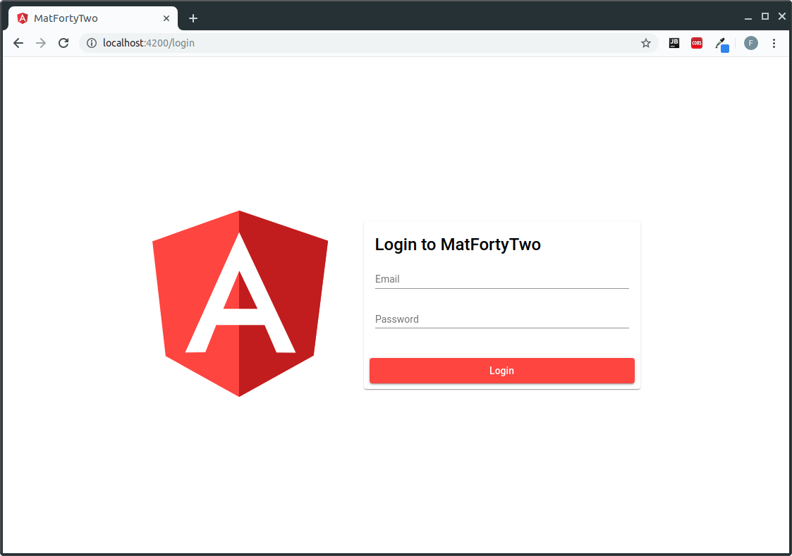

# platform-for-good

The answer to everything (well... almost) that's Angular Material

## Description

platform-for-good is a boilerplate for Angular Material that promotes a design
with two separate navigation stacks. One at root level and one (with title
and sidenav) accessible only after having logged in. It also packs a lot
of perks to help you kickstart your Angular project in a matter of minutes!

Angular CLI Version: 8.0.1 \
Angular Material Version: 8.0.0

## Perks
 - **Navigation Flow and guarded access for Pages**
 - **Script to generate root/sidenav page**
 - **Theming**
 - **Complete authorization flow with Token**
 - **Lazy Loaded Pages**
 - **Pre-built responsive Sidenav Component and Login Page**
 - **Linting with pre-commit check**
 - **Many more coming soon...**
 
You can just focus on the content of your application! If you use the 
built-in scripts for page generation, everything else will be taken care 
of for you!

## Script Usage
This will generate a new component (**PageNamePageComponent**) with routing in 
**_src/app/pages/page-name_** 

**!!!Use kebab-case for page names!!!**
```bash
# GENERATE A ROOT PAGE
npm run genpage -- -r page-name

# GENERATE A SIDENAV PAGE    
npm run genpage -- -n page-name

# GENERATE A PAGE THAT'S BOTH ROOT AND SIDENAV
npm run genpage -- -rn page-name

# GENERATE A CHILD SIDENAV PAGE
npm run genpage -- -c page-name

# GENERATE A SIDENAV PAGE WITH SPECIFIC ICON NAME (mat-icon)
# (The icon will be in the sidenav next to the tile of the page)
npm run genpage -- -n page-name -i home
```

If you want to edit further, you can find the generated routes in:\
**_src/app/app-routing.module.ts_** - Root Page \
**_src/app/nav-routing.ts_** - SideNav Page

## About Child Sidenav Pages

Child Sidenav Pages are pages that are meant to be accessible only
through navigation from a sidenav page. They will not appear in the list
in the sidenav menu and will show a back button in the top bar that
will send you to the parent page when clicked. They will also automatically
highlight the parent item in the sidenav menu, even when accessed directly
through URL.<br><br>
Since children pages are always relative to a parent page, some additional
configuration will be needed after running the script. The child route
needs to be defined in the parent page's routing module. The data
property for this new route needs to contain a title and a "isChild"
attribute set to true.<br><br>
**Let's have a look at a practical example:**<br>
We have a sidenav page called "home-page" and we want a child page
named "child-page" that we can access from "home-page" instead of
the sidenav menu.<br><br>
**First, we run the script for child sidenav pages**
```
npm run genpage -- -c child
```
Now that the page has been generated, we can see that it is not present
in the sidenav menu list ( just as we expected ).<br><br>
**Next step is to add the child route in the "home-page" routing module**
<br><br>
This is how the **routes** in your **_home-page-routing.module_** should look like:
```typescript
const routes: Routes = [
    {
        path: '',
        data: { shouldReuse: true, key: 'home' },
        component: HomePageComponent,
    },
]
```
**Simply add the new child route to this file like this:**
```typescript
const routes: Routes = [
    {
        path: '',
        data: { shouldReuse: true, key: 'home' },
        component: HomePageComponent,
    },
    {
        path: 'child',
        loadChildren: () =>
            import('../child-page/child-page.module').then(
                m => m.ChildPageModule,
            ),
        data: { title: 'Child', isChild: true },
    },
]
```
Now, if you navigate to **YOUR_NAV_URL** **_/home/child_**
you should see a page with the title "Child", a back button that will
redirect you to the home page and the child component being correctly
rendered in the content container below.<br><br>
**NB:** It is of course possible to define a page that's the child of a child,
but it's essential to avoid to create any loop to previous pages
because that will break your application.<br>
It's also not necessary to define the isChild attribute for children
at a deeper level, as this information will be passed through by the
first one.


## Theming

Simply go to **_src/variables.scss_** and change the values for
font, primary, accent or warn color.

## Screenshots
Login Page



 Sidenav Page
 


Different Theme

``` diff
variables.scss

- $my-app-primary: mat-palette($mat-red);
+ $my-app-primary: mat-palette($mat-blue);
```


